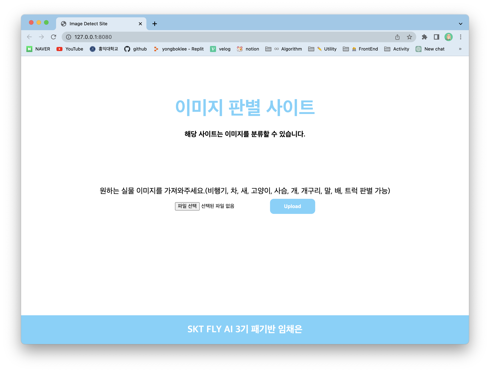
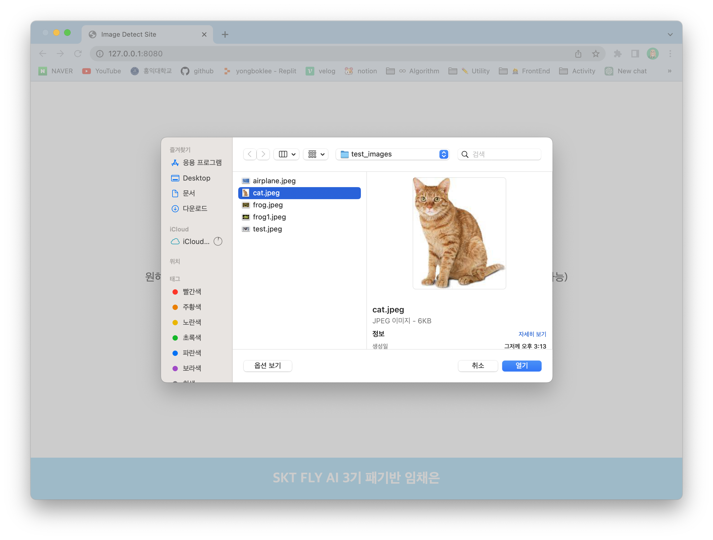
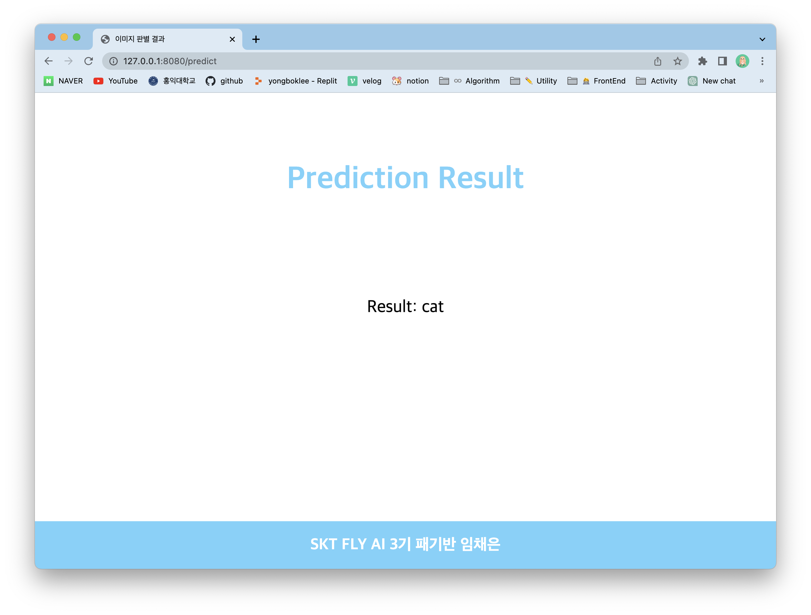

# My Image Classification Website

이 웹사이트는 사용자가 업로드한 이미지를 분류하는 이미지 분류 서비스입니다. 웹사이트에서 이미지를 선택하고 제출하면, 서버는 해당 이미지를 분류하여 결과를 반환합니다.

## 실행 방법

### 도커 환경에서 실행하기

1. Docker가 설치되어 있는지 확인하세요.

2. 터미널 또는 명령 프롬프트에서 다음 명령어를 실행하여 Docker 이미지를 빌드하세요.

   ```shell
   docker build -t flask-app .
   ```

3. 다음 명령어를 실행하여 Docker 컨테이너를 실행하세요.

   ```shell
   docker run -p 8080:8080 flask-app
   ```

4. 웹 브라우저에서 http://localhost:8080에 접속하여 웹사이트를 열어보세요.

## 사용 방법

1. 웹사이트에 접속하면 이미지를 업로드할 수 있는 영역이 표시됩니다.
   

2. '이미지 선택' 버튼을 클릭하여 분류할 이미지를 선택하세요.
   

3. 선택한 이미지가 표시되면 'Upload' 버튼을 클릭하세요.

4. 서버는 선택한 이미지를 분류하여 결과를 반환하고, 결과가 화면에 표시됩니다.
   
